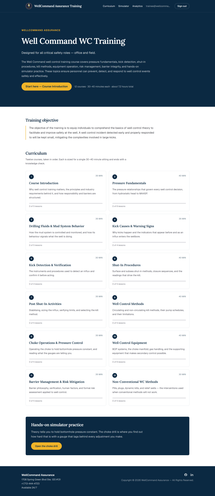
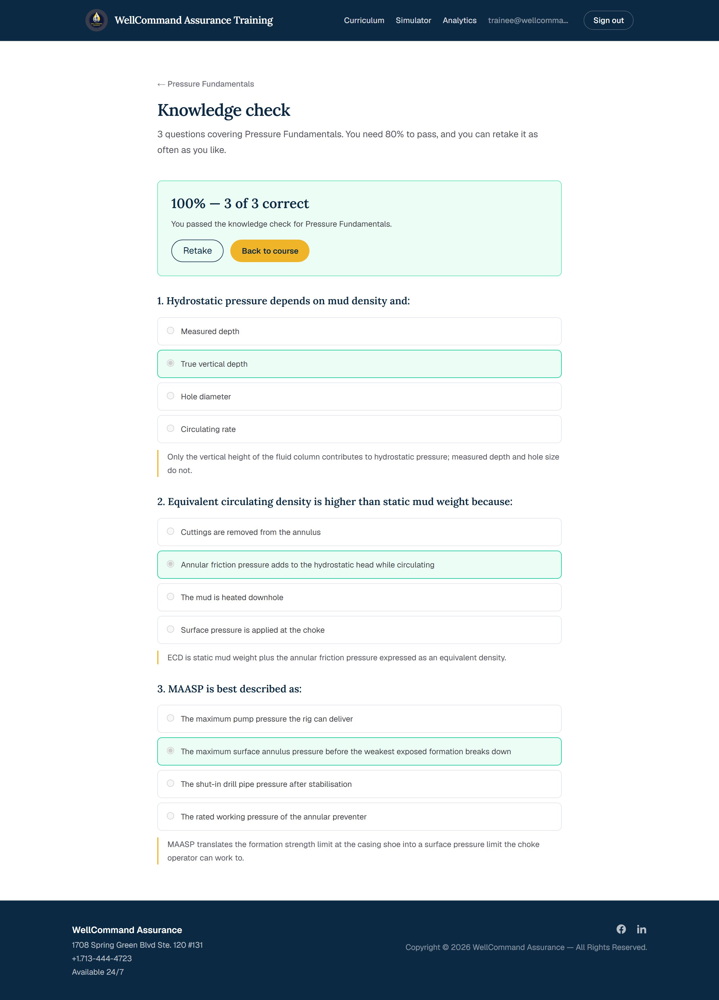
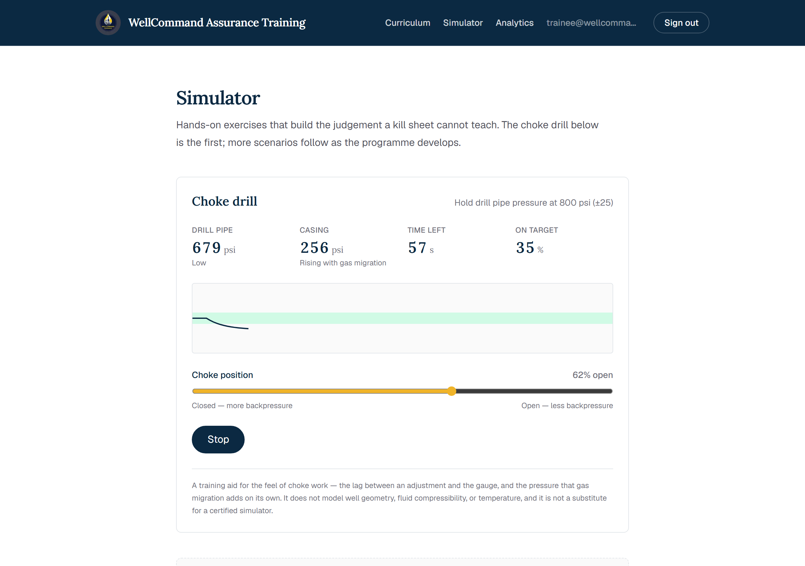
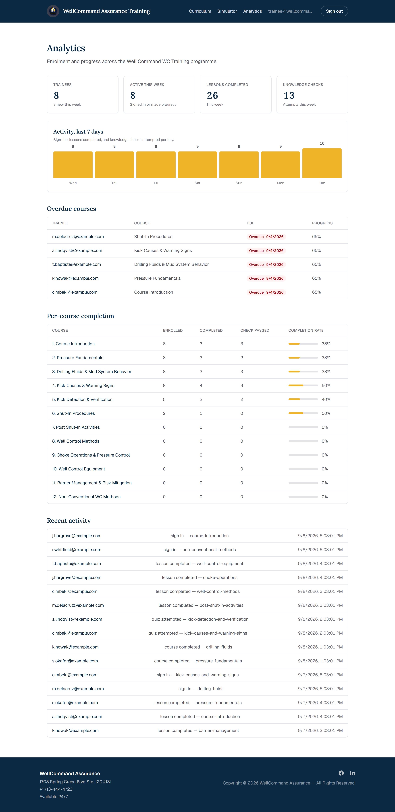
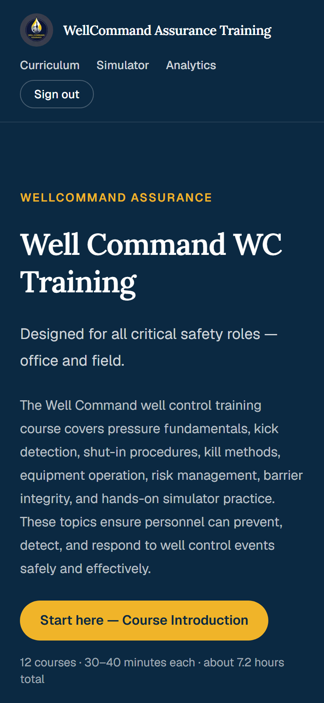

<div align="center">


# Well Command WC Training

**Well control training for every safety-critical role — office and field.**

[](https://nextjs.org)
[](https://www.typescriptlang.org)
[](https://tailwindcss.com)
[](https://docs.amplify.aws)
[](https://aws.amazon.com)

</div>

---

## What this is

A private training platform for [WellCommand Assurance](https://wellcommandassurance.com), built to deliver their well control curriculum as **twelve self-contained courses of 30–40 minutes each**.

> The objective of the training is to equip individuals to comprehend the basics of well control theory to facilitate and improve safety at the well. A well control incident detected early and properly responded to will be kept small, mitigating the complexities involved in large kicks.

The programme runs from pressure fundamentals through kick detection, shut-in procedures, and kill methods, to barrier management and non-conventional interventions. Every course opens with its learning objectives, ends with a knowledge check, and issues a certificate when both are complete. Progress is stored per account, so the office can see who has trained on what.

Access requires an account — every page sits behind AWS Cognito.

---

## 📸 What it looks like

### Sign in

Registration and sign-in run through Cognito, restyled in the WellCommand navy and gold.


### Programme overview

The objective, the full twelve-course curriculum map with durations, and per-course progress.



### Course and lesson

Each course leads with what the learner will be able to do, how long it takes, and what to take first.

| Course page | Lesson |
|---|---|
|  |  |

### Knowledge check

Multiple choice, 80% to pass, unlimited retakes, with an explanation on every question — right or wrong.



### Choke drill simulator

Hold drill pipe pressure at the initial circulating pressure while a first-order lag delays every adjustment and gas migration pushes casing pressure up on its own.



### Analytics

For WellCommand staff: signups, active trainees, weekly progress, overdue courses, and per-course completion.



<sub>Shown with sample data — the dashboard reads live records in production.</sub>

### On a phone

Field personnel open this on a phone, so every page works at 390px.



---

## ✨ Features

| | |
|---|---|
| 🔐 **Account-gated** | Email + password via AWS Cognito, with verification mail sent through SES |
| 📚 **Twelve structured courses** | Ordered curriculum with objectives, durations, prerequisites, and draft/published status |
| ✅ **Knowledge checks** | Per-course multiple choice, 80% pass mark, per-question explanations, best attempt kept |
| 🎓 **Certificates** | Printable completion record, issued only when lessons *and* the knowledge check are done |
| 🎛️ **Choke drill** | Interactive pressure-control exercise with realistic lag and gas migration |
| 📊 **Analytics** | Signups, active trainees, weekly progress, overdue courses, completion and pass rates |
| 📈 **Progress that follows the account** | Stored in DynamoDB, not the browser — the same learner, any device |
| 📱 **Built for the field** | Responsive to 390px, keyboard navigable, labelled for screen readers |

---

## 🏗️ How it works

| Layer | Choice | Why |
|---|---|---|
| Framework | **Next.js 16**, App Router | Static generation for every lesson; one deployment target |
| Language | **TypeScript** | The curriculum is typed data — a bad quiz answer index fails the build |
| Styling | **Tailwind CSS 4** | `@theme inline` tokens carry the navy/gold brand from the parent site |
| Auth | **AWS Cognito** via Amplify Gen 2 | Managed sign-up, verification, and group-based admin access |
| Data | **AppSync + DynamoDB** via Amplify Data | Owner-scoped records, admin read across all of them |
| Email | **Amazon SES** | Cognito's default sender does not reliably reach Gmail or Yahoo |
| Hosting | **AWS Amplify Hosting**, `us-east-1` | Backend and frontend deploy from the same push |

### The data model

Shaped for reporting, not just display — an append-only event log partitioned by ISO day means "progress this week" is seven cheap reads rather than a table scan.

| Model | Holds |
|---|---|
| `Trainee` | Identity, company, role, `signedUpAt`, `lastSeenAt`, sign-in count |
| `Enrollment` | Trainee × course standing — status, `dueAt`, percent complete, best quiz score |
| `LessonCompletion` | One timestamped row per lesson completed |
| `QuizAttempt` | Every attempt, with score and pass flag |
| `ActivityEvent` | `SIGN_UP`, `SIGN_IN`, `LESSON_COMPLETED`, `QUIZ_ATTEMPTED`, `COURSE_COMPLETED` |

---

## 🚀 Local development

> **Node version matters.** Use **Node 20** for Amplify CLI (`ampx`) commands and **Node 24** for Next.js. Node 22+ has a type-stripping bug that breaks `ampx` on Windows.

```bash
npm install

# Node 20 — deploy a personal sandbox backend and write amplify_outputs.json
nvm use 20
AWS_REGION=us-east-1 npx ampx sandbox

# Node 24 — run the app
nvm use 24
npm run dev
```

Open <http://localhost:3000>. You will need to register an account; the verification code arrives by email.

| Command | Does |
|---|---|
| `npm run dev` | Dev server (webpack — Turbopack's binary is blocked by Windows Application Control) |
| `npm run build` | Production build, type check included |
| `npx eslint src amplify --max-warnings=0` | Lint |
| `npx ampx sandbox delete` | Tear down your sandbox backend |

---

## ☁️ Deployment

Pushing to `main` triggers AWS Amplify Hosting, which runs both phases from [`amplify.yml`](amplify.yml): `ampx pipeline-deploy` for the backend, then `next build` for the frontend.

**All AWS resources live in `us-east-1` (N. Virginia)** — the Amplify app, the Cognito user pool, and the SES identities. Set the region explicitly on CLI calls; a profile defaulting elsewhere will silently deploy to the wrong place.

---

## 📁 Layout

```
amplify/
  auth/resource.ts       Cognito — email login, SES sender, admins group
  data/resource.ts       AppSync schema: trainees, enrollments, progress, activity
src/
  app/                   Routes: programme, courses, lessons, knowledge checks,
                         certificates, simulator, admin analytics
  components/            Site chrome, progress bar, choke drill
  lib/
    curriculum.ts        All twelve courses as typed data
    ProgressProvider.tsx Account-backed progress, written through optimistically
    analytics.ts         Time-window helpers shared by recording and reporting
docs/
  simulator.md           Simulator roadmap and build-vs-licence comparison
  authoring.md           How content gets in, and how to get the developer out of it
  screenshots/           The images above
```

---

## 📝 Content status

The curriculum **structure** is complete and follows WellCommand Assurance's outline exactly. Lesson bodies are outline-level placeholders — the final subject matter is authored by WellCommand Assurance and tracked per section in the [issues](https://github.com/yewtaah/well-control-training/issues).
