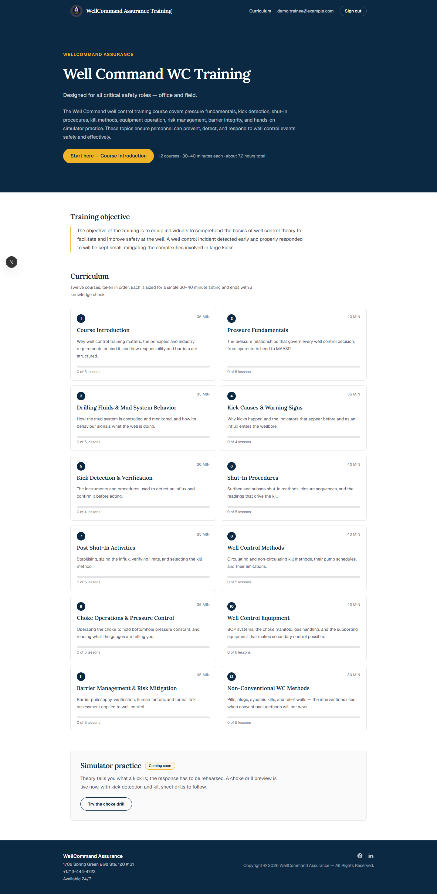
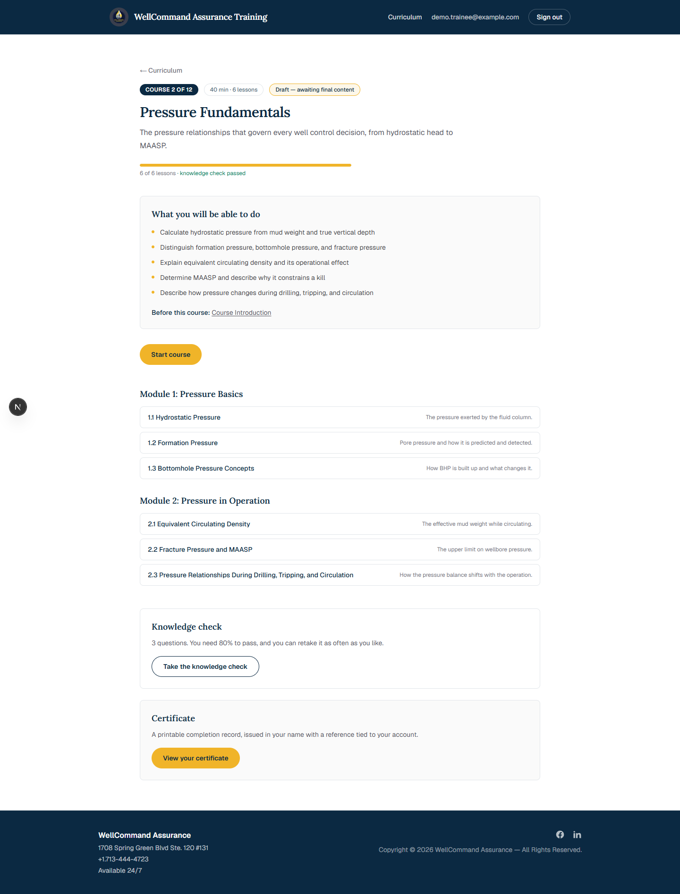
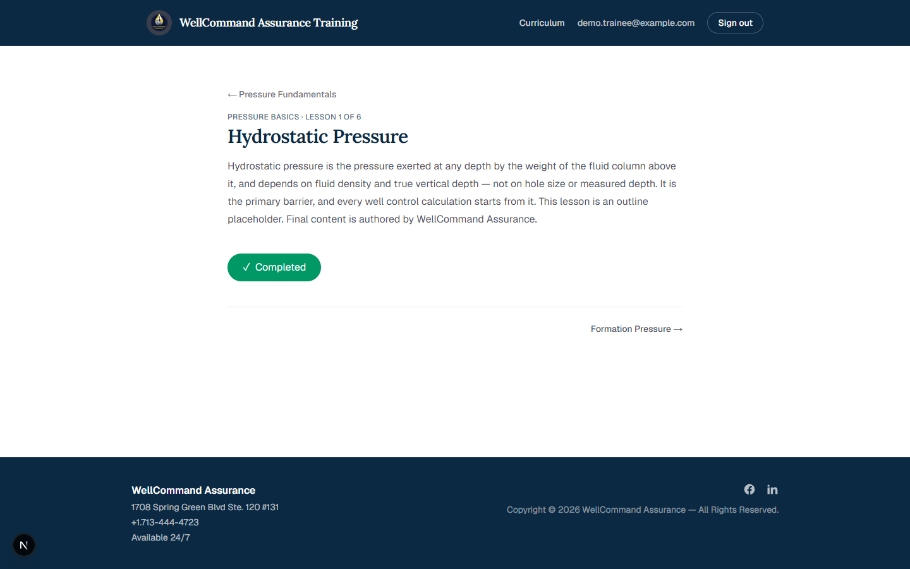
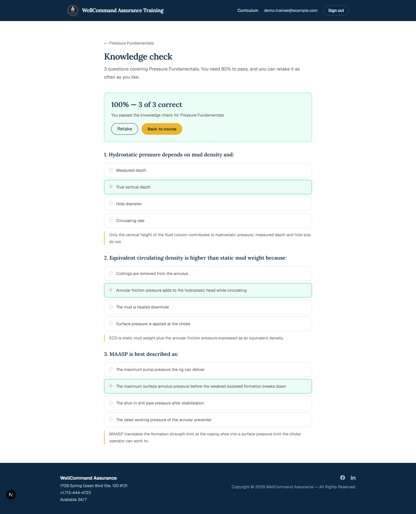
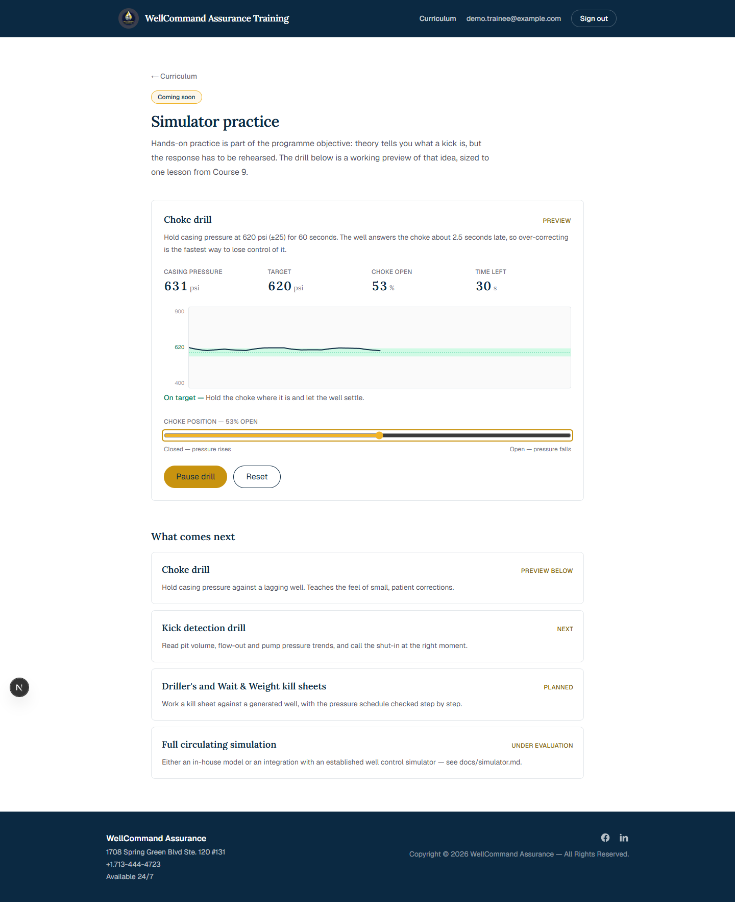
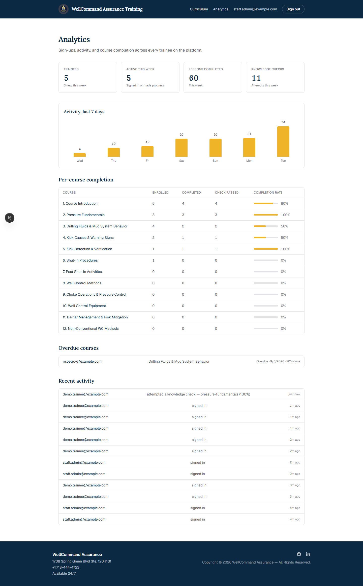
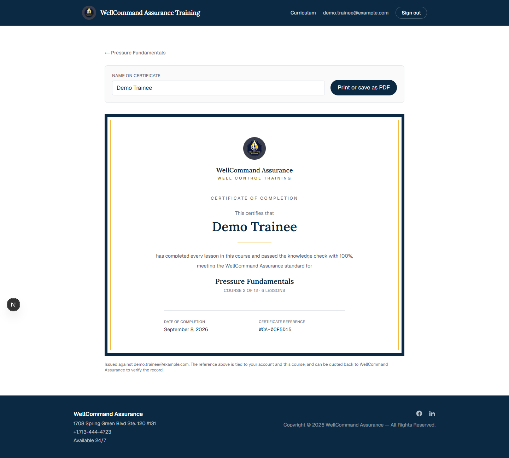
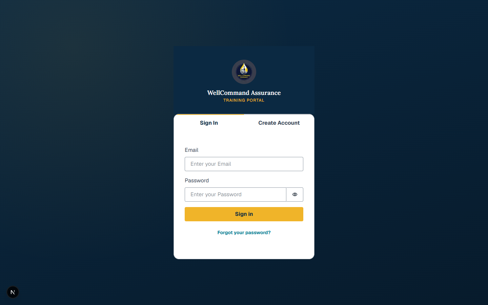
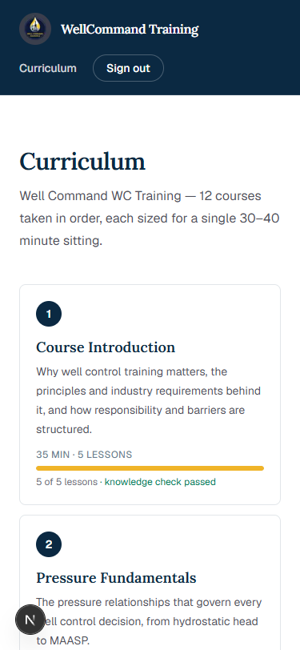

<div align="center">


# Well Command WC Training

**Well control training for every critical safety role — office and field.**

The training and knowledge-sharing platform of
[WellCommand Assurance](https://www.wellcommandassurance.com), served at
`training.wellcommandassurance.com`.

[](https://nextjs.org)
[](https://www.typescriptlang.org)
[](https://tailwindcss.com)
[](https://docs.amplify.aws)
[-232F3E?logo=amazonaws&logoColor=white)](https://aws.amazon.com/amplify/hosting/)

</div>

---

## What it is

A self-paced well control course, delivered in the browser and gated behind an
account. Twelve courses run in order — from pressure fundamentals through kick
detection, shut-in procedures and kill methods, to barrier management and
non-conventional methods — each sized for a single 30–40 minute sitting and
closed out by a knowledge check.

Progress lives on the trainee's account rather than in their browser, so
someone can start a lesson on a rig laptop and finish it on their phone. Once
every lesson in a course is done and its knowledge check is passed, the platform
issues a printable completion certificate. WellCommand Assurance staff get a
dashboard showing who signed up, who is active, and how each course is landing.

> **Training objective** — equip individuals to comprehend the basics of well
> control theory to facilitate and improve safety at the well. A well control
> incident detected early and properly responded to will be kept small,
> mitigating the complexities involved in large kicks.

## Screenshots

<table>
<tr>
<td width="50%"></td>
<td width="50%"></td>
</tr>
<tr>
<td><b>Programme overview</b> — objective, curriculum map, and progress across all twelve courses.</td>
<td><b>Course page</b> — learning objectives, prerequisites, module breakdown, knowledge check and certificate.</td>
</tr>
<tr>
<td></td>
<td></td>
</tr>
<tr>
<td><b>Lesson</b> — one idea per screen, with a completion toggle that syncs to the account.</td>
<td><b>Knowledge check</b> — scored immediately, with an explanation on every question and unlimited retakes.</td>
</tr>
<tr>
<td></td>
<td></td>
</tr>
<tr>
<td><b>Choke drill</b> — a preview of simulator practice: hold casing pressure against a well that answers the choke late.</td>
<td><b>Analytics</b> — sign-ups, weekly activity, per-course completion and pass rates, overdue courses.</td>
</tr>
<tr>
<td></td>
<td></td>
</tr>
<tr>
<td><b>Certificate</b> — issued in the trainee's name with a reference tied to their account; prints straight to PDF.</td>
<td><b>Sign in</b> — Cognito-backed accounts, in WellCommand Assurance branding.</td>
</tr>
</table>

<div align="center">

<br>
<sub><b>On a phone</b> — the audience includes field personnel, so every page works at 375px.</sub>
</div>

More captures, with notes for walking a client through them, are in
[`docs/screenshots/`](docs/screenshots/README.md).

## Features

**📚 Courseware**
- 12 courses · 24 modules · 60 lessons, taken in order, ~7 hours in total
- Per-course learning objectives, prerequisites and duration shown up front
- Lesson-by-lesson completion, resumable across devices

**✅ Assessment**
- A knowledge check on every course — 36 questions across the programme
- Immediate scoring, an explanation on every question, unlimited retakes
- Best attempt kept; every attempt recorded for reporting

**🏅 Recognition**
- Printable completion certificate per course, and one for the full programme
- Issued in the trainee's name with a reference derived from their account
- Print styles drop the site chrome so it saves cleanly as a PDF

**🎛️ Practice**
- A working choke drill: hold casing pressure against a lagging well and get scored
- Roadmap for kick detection, shut-in sequence and kill-sheet drills — see [`docs/simulator.md`](docs/simulator.md)

**📊 Reporting**
- Staff dashboard gated to the `admins` Cognito group
- Sign-ups, active trainees, lessons and checks completed this week
- Per-course completion and pass rates, overdue courses, recent activity feed

**🔐 Accounts & access**
- Email + password accounts via AWS Cognito, verification mail sent through SES
- Every trainee owns their own records; admins read across all of them
- Progress written through to the account, cached locally, and replayed if a write fails offline

**♿ Built for the field**
- Works at 375px, on the phone someone actually has on site
- WCAG AA contrast, visible focus, skip link, keyboard-navigable throughout

## Curriculum

| # | Course | Lessons | Time |
|---|--------|---------|------|
| **1** | Course Introduction | 5 | 35 min |
| **2** | Pressure Fundamentals | 6 | 40 min |
| **3** | Drilling Fluids & Mud System Behavior | 5 | 35 min |
| **4** | Kick Causes & Warning Signs | 4 | 35 min |
| **5** | Kick Detection & Verification | 4 | 30 min |
| **6** | Shut-In Procedures | 5 | 40 min |
| **7** | Post Shut-In Activities | 5 | 35 min |
| **8** | Well Control Methods | 5 | 40 min |
| **9** | Choke Operations & Pressure Control | 5 | 35 min |
| **10** | Well Control Equipment | 6 | 40 min |
| **11** | Barrier Management & Risk Mitigation | 5 | 35 min |
| **12** | Non-Conventional WC Methods | 5 | 30 min |

## How it works

| Layer | Choice | Why |
|-------|--------|-----|
| **Frontend** | Next.js 16 (App Router), React 19, TypeScript | Course pages are static — prerendered at build time from the curriculum, no per-request work |
| **Styling** | Tailwind CSS v4 with brand tokens | Navy/gold WellCommand Assurance palette defined once in `globals.css` |
| **Content** | `src/lib/curriculum.ts` | The whole programme as typed data, so routes, progress and reporting all agree on one shape |
| **Auth** | AWS Cognito via Amplify Gen 2, SES for mail | Email/password accounts, an `admins` group for staff |
| **Data** | AppSync + DynamoDB via Amplify Data | Owner-scoped rows; admins read across everything |
| **Hosting** | AWS Amplify Hosting (us-east-1) | Push to `main` deploys the backend, then the frontend |

### Data model

Progress is stored as immutable, timestamped rows plus a rolled-up enrollment
per trainee × course, so reporting is an index query rather than a scan.

| Model | Holds | Indexed by |
|-------|-------|-----------|
| `Trainee` | Identity, company, sign-up and last-seen | `email` |
| `Enrollment` | One trainee × course: status, % complete, best quiz score, due date | `courseSlug + status`, `status + dueAt` |
| `LessonCompletion` | One row per lesson ticked off | `courseSlug + completedAt` |
| `QuizAttempt` | Every attempt, with score and pass flag | `courseSlug + attemptedAt` |
| `ActivityEvent` | Append-only log of sign-ups, sign-ins and progress | `day + occurredAt`, `type + occurredAt` |

### Routes

| Route | What it is |
|-------|-----------|
| `/` | Programme overview — objective, curriculum, simulator callout |
| `/courses` | Curriculum index with per-course progress |
| `/courses/[course]` | Course page — objectives, modules, knowledge check, certificate |
| `/courses/[course]/[module]/[lesson]` | Lesson, with a completion toggle |
| `/courses/[course]/knowledge-check` | Scored knowledge check |
| `/courses/[course]/certificate` | Course completion certificate |
| `/certificate` | Programme certificate — all twelve courses |
| `/simulator` | Choke drill preview and simulator roadmap |
| `/admin` | Analytics dashboard (`admins` group only) |

## Running it locally

Requires **Node 20** (the Amplify CLI does not resolve its backend modules
correctly on Node 24) and AWS credentials for the target account.

```bash
npm install
npx ampx sandbox        # personal Cognito + AppSync backend; writes amplify_outputs.json
npm run dev             # in a second terminal
```

Open <http://localhost:3000> and create an account. To give yourself the staff
dashboard, add your user to the `admins` group:

```bash
aws cognito-idp admin-add-user-to-group \
  --user-pool-id <pool-id-from-amplify_outputs.json> \
  --username <your-email> --group-name admins --region us-east-1
```

To fill a sandbox with demo trainees and progress — useful for demos and for
refreshing the screenshots — run the seeder (never against production):

```bash
npx tsx scripts/seed-demo-data.ts
```

| Command | Does |
|---------|------|
| `npm run dev` | Dev server |
| `npm run build` | Production build |
| `npm run lint` | ESLint |
| `npx ampx sandbox` | Deploy/watch a personal backend |
| `npx ampx sandbox delete` | Tear it down |
| `npx tsx scripts/seed-demo-data.ts` | Seed demo trainees and progress |

## Deployment

Connected to AWS Amplify Hosting in `us-east-1`. A push to `main` runs
[`amplify.yml`](amplify.yml), which deploys the backend with
`ampx pipeline-deploy` before building the Next.js frontend.

## Contributing

Work is tracked as [GitHub issues](https://github.com/yewtaah/well-control-training/issues).
Branch off `main`, reference the issue from your commits (`Closes #12`), and
merge through a pull request — feature work does not land on `main` directly.

Course content lives in [`src/lib/curriculum.ts`](src/lib/curriculum.ts) as
typed data; adding a lesson is an edit to that file, not a new route.
